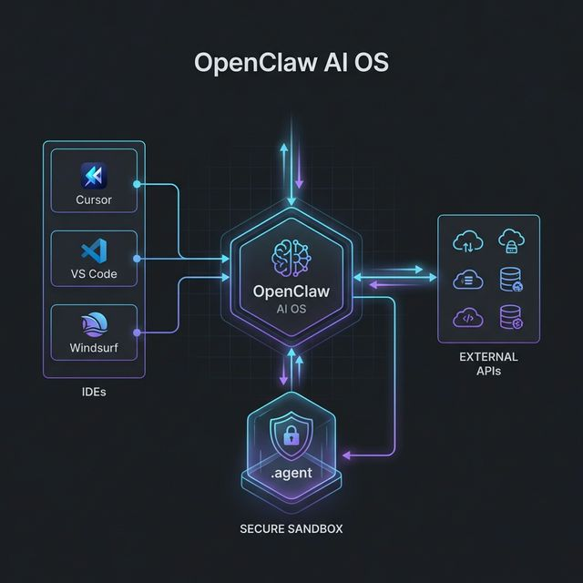
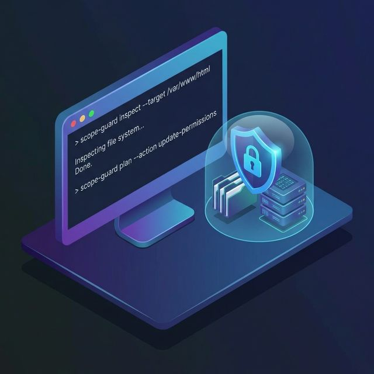
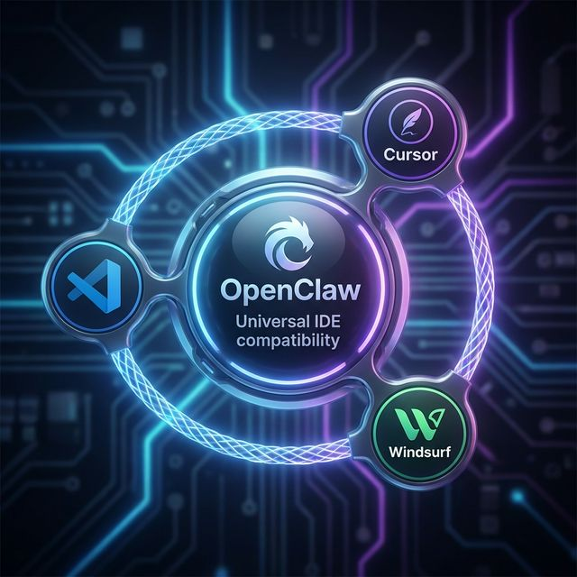

# 🦀 OpenClaw AI OS
**Sistema operacional de agentes de IA seguro, auditável e controlável**

*Execução via Gateway • Configuração via IDE (opcional) • Controle total*



---

## 🧠 O que é o OpenClaw?

O OpenClaw é um sistema operacional de agentes de IA que instala uma camada de segurança, automação e governança dentro do seu projeto.

Ele permite que você use agentes de IA de forma segura, auditável e profissional, sem risco de a IA alterar arquivos ou sistemas sem autorização.

Ele funciona em qualquer ambiente:
- Local
- VPS
- Docker
- VPN
- SSH Tunnel
- Infraestrutura cloud privada

E pode ser configurado por:
- Terminal (modo profissional)
- Chat de IDE (modo assistido)

**Mas a execução real do agente acontece via Gateway Web ou CLI, não via chat da IDE.**

---

## 🏗️ Arquitetura do OpenClaw

O OpenClaw funciona em 3 camadas:
1. **IDE Chat (opcional)** → Configuração e manutenção
2. **Terminal/CLI** → Instalação e orquestração
3. **Gateway Web/API** → Execução real das tarefas

A IDE ajuda a construir e manter.
O Gateway é onde o agente opera de verdade.

---

## 🌐 Onde o OpenClaw pode rodar

Você pode instalar o OpenClaw em qualquer cenário.

### 💻 Local (desenvolvimento)
- roda no seu PC
- acesso: `http://localhost:8000`
- ideal para testes e criação de skills

### ☁️ VPS (produção)
- DigitalOcean, AWS, Contabo, etc
- recomendado com VPN
- acesso via IP privado ou túnel

### 🔐 VPS + VPN (recomendado)
**Seu caso atual:**
- OpenClaw na VPS
- Acesso via WireGuard/OpenVPN
- Gateway bind em `127.0.0.1`
- Maior segurança possível.

### 🐳 Docker
- roda isolado em container
- fácil backup e portabilidade
- ideal para ambientes profissionais

### 🔒 SSH Tunnel
Caso não queira VPN:
`ssh -L 8000:localhost:8000 usuario@vps`
Acesse localmente com segurança.

---

## 🏗️ Novo projeto do zero

Você pode iniciar o OpenClaw de duas formas:

### 🔹 Terminal (Recomendado)
```bash
npx openclaw init --apply
npx openclaw ide install --apply
npx openclaw gateway start
```

### 🔹 Assistido pela IDE
1. Instale as regras base via terminal: `npx @fabioforest/openclaw init --apply`
2. Abra seu projeto na IDE com IA (Ex: Cursor).
3. Peça no chat:
   > *"Verifique a instalação do OpenClaw e configure o gateway e os adaptadores corretamente."*

---

## 🚀 Instalação Rápida (Passo a Passo)

**1. Instalar OpenClaw no projeto**
```bash
npx @fabioforest/openclaw init --apply
```
Cria a estrutura segura `.agent/`

**2. Instalar adaptadores de IDE (opcional)**
```bash
npx @fabioforest/openclaw ide install --apply
```
Ele detecta e pergunta se deseja instalar adaptadores para Cursor, VS Code, Windsurf, Qoder, Trae, Antigravity, Codex.
*Adaptadores são opcionais e servem apenas para manutenção/configuração.*

**3. Verificar saúde**
```bash
npx @fabioforest/openclaw ide doctor
```

---

## 🧠 Como usar corretamente (REGRA DE OURO)

O OpenClaw tem dois modos de uso.

### 🟢 1. Uso real do agente (runtime)
Aqui o agente executa tarefas de verdade.

**Via terminal:**
```bash
npx @fabioforest/openclaw gateway start
```

Depois acesse no navegador:
`http://localhost:8000`
Ou via VPN/IP privado.

**É aqui que você usa:**
- `site-tester`
- `linkedin-optimizer`
- automações
- agentes
- workflows

Este é o **uso principal**.

### 🟡 2. Configuração e manutenção (IDE ou Terminal)

Você pode usar:

**Terminal (Modo profissional e seguro)**
```bash
npx @fabioforest/openclaw assist
npx @fabioforest/openclaw inspect
npx @fabioforest/openclaw update --apply
```

**Chat da IDE (Opcional - Painel de Engenharia)**
Use para:
- criar skills
- corrigir bugs
- revisar configs
- instalar módulos
- criar automações
- hardening de segurança
- revisar logs

*Exemplo:*
> "Verifique minha instalação do OpenClaw e sugira melhorias de segurança"

**Mas o uso real continua sendo via Gateway.**

---

## 🔐 Fluxo de segurança obrigatório



Nada no OpenClaw executa sem passar por:

1. **INSPECT** (somente leitura)
2. **PLAN** (plano do que será feito)
3. **CONSENT** (sua autorização)
4. **APPLY** (execução)
5. **AUDIT** (registro completo)

*Modo padrão: simulação (PLAN). Só executa com `--apply`.*

---

## 🧠 Skills incluídas

Exemplos:
- `site-tester`
- `linkedin-optimizer`
- `vps-cloud-infra`
- `legacy-cleanup`
- `openclaw-dev` (modo Devin)
- automações web
- auditoria de segurança
- multi-agent mission control

Todas acessíveis via **Gateway ou CLI**.

---

## 🔌 Compatibilidade de IDEs (manutenção)



O OpenClaw pode se integrar a:
- Google Antigravity
- Cursor
- VS Code
- Windsurf
- Trae
- Qoder
- Codex

Mas **apenas para configurar e manter o sistema**.
Não é necessário usar IDE para operar o agente.

---

## 🧠 Exemplos de uso correto

**Criar nova skill**
No chat da IDE:
> *Crie uma nova skill para backup automático e mostre o plano antes de aplicar*

**Corrigir configuração**
No chat da IDE:
> *Verifique openclaw.json e corrija portas e bind de segurança*

**Uso real**
No navegador (Web UI) ou Terminal:
> *Execute site-tester no domínio X*

---

## 🛡️ Segurança

O OpenClaw bloqueia:
- `rm -rf`
- deleções em massa
- alterações críticas
- execução root sem aviso
- exposição pública sem auth

Tudo precisa de consentimento.

---

## 🎯 Filosofia

**A IA não deve ter controle. Você deve.**

O OpenClaw existe para:
- impedir automações perigosas
- permitir automação avançada segura
- dar controle total ao usuário
- transformar IA em ferramenta profissional

---

## 🧪 Público ideal
- Devs
- Engenheiros de IA
- Infra/DevOps
- Criadores de agentes
- Automação avançada
- Empresas com IA interna

---

## 📜 Licença
MIT

---

## 🧠 Visão

OpenClaw não é um plugin.
Não é um chatbot.
Não é só automação.

**É um sistema operacional de agentes.**
E o operador continua sendo você.
