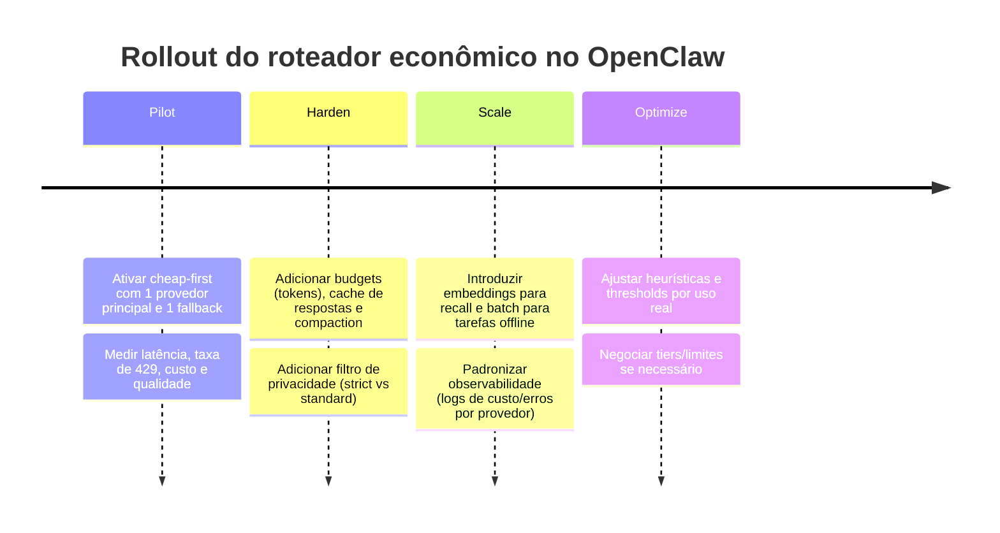
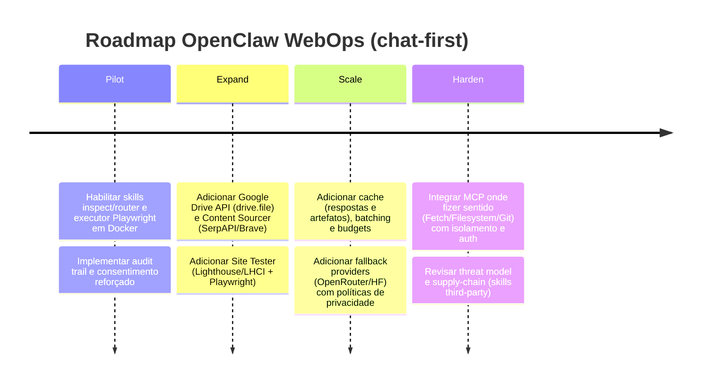

# IAs com camadas gratuitas e estratégias de integração econômica para OpenClaw

## Resumo executivo

A forma mais robusta de manter **custo mínimo** no OpenClaw sem depender de modelos locais é combinar: (i) pelo menos **um provedor com “free tier” real para texto** (ex.: Gemini), (ii) um **provedor com endpoint OpenAI‑compatível** para reduzir fricção de integração (ex.: Groq/OpenRouter/Cohere Compatibility), e (iii) um conjunto de **técnicas de controle de consumo** (roteador econômico + caching + batch + sumarização + embeddings + cache de respostas). citeturn16view2turn22view0turn23view3turn5view0turn7search27  

Entre as opções “free/freemium” mais úteis hoje, o **Google Gemini Developer API** se destaca por oferecer chamadas “free of charge” em modelos como **Gemini 2.5 Flash/Flash‑Lite/2.5 Pro** (com limitações e regras de uso), além de preços competitivos quando sai do free tier. citeturn16view2turn14view2turn16view2  
No ecossistema OpenAI‑compatível, **Groq** oferece plano gratuito sem cartão, com limites explícitos por modelo (RPM/RPD/TPM/TPD) e uma API OpenAI‑style (`https://api.groq.com/openai/v1/...`), o que facilita muito o roteador econômico multi‑provedor. citeturn6view2turn8view0turn5view2  
Para ampliar cobertura de modelos com governança de privacidade (inclusive **ZDR** em rotas específicas), **OpenRouter** é útil como “agregador” OpenAI‑compatível, com plano free com limites de requisições e controles de logging/ZDR (atenção: políticas variam por endpoint/provedor). citeturn1search3turn7search13turn7search3turn7search7  

Do ponto de vista de segurança e compliance, o que mais reduz risco é: **minimizar dados enviados**, preferir provedores/planos que **não treinam com seus dados por padrão** (ou permitir opt‑out), ativar **Zero Data Retention** quando disponível e implementar **travas contra consumo ilimitado** (rate‑limit handling + budget + fallback). Esse tipo de postura está alinhado com riscos comuns mapeados para aplicações com LLMs (ex.: prompt injection, insecure output handling, sensitive disclosure, unbounded consumption). citeturn26search0turn26search9turn2view3turn10view3turn20search3  

## Panorama dos provedores com camadas gratuitas ou freemium

A tabela abaixo resume provedores relevantes para uso “cloud” (não local) com alguma camada gratuita, trial ou freemium útil para prototipação/baixo custo. Onde algum detalhe **não está explicitado** em documentação oficial acessível (ex.: quantidade exata de créditos do free tier), marco como **“não especificado”**.

### Tabela comparativa dos provedores

| Provedor | Modelo exemplo | Free tier / trial | Limites (rate/quota) | Casos de uso ideais | Privacidade (logs/treino/retenção) | Nota de integração |
|---|---|---|---|---|---|---|
| entity["company","Google","big tech company"] (Gemini Developer API) | `gemini-2.5-flash-lite` (cheap) / `gemini-2.5-pro` (smart/coding) | “Free of charge” em vários modelos de texto; preços PAYG quando aplicável. citeturn16view2turn14view2turn16view2 | Limites variam por modelo e por tier; quotas/reset e disponibilidade por país; limites não são garantidos e podem mudar; free tier só em países elegíveis. citeturn2view0turn2view2turn14view2 | Chat geral e alto throughput com Flash/Flash‑Lite; raciocínio/código com Pro. citeturn14view2turn16view2 | “Data used to improve products” = **Sim** no Free; **Não** no Paid; há opção de **Zero Data Retention** para serviços pagos e restrição de treino. citeturn16view2turn3search2 | REST simples com `x-goog-api-key`; endpoints `generateContent`/`streamGenerateContent`. citeturn12search4turn12search0 |
| entity["company","OpenAI","ai company"] | `gpt-5 mini` (cheap‑paid) / `gpt-5.2` (smart/coding‑paid) | Para **LLM tokens**, “free tier” **não especificado** (a precificação é pay‑as‑you‑go). | Rate limits dependem do plano/conta (não detalhado aqui). | Quando você quer um “fallback premium” altamente consistente; também útil para embeddings baratos com Batch. citeturn22view0turn27search0 | API: dados não são usados para treinar por padrão; retenção por até 30 dias para abuso; ZDR possível para clientes elegíveis. citeturn2view3 | Recomenda-se `/v1/responses` para novos projetos; autenticação Bearer. citeturn9search9turn12search3 |
| entity["company","Anthropic","ai company"] (Claude API) | `Claude Haiku` (cheap‑paid) / `Claude Sonnet` (smart/coding‑paid) | Novos usuários recebem “pequena quantidade” de créditos (valor não especificado). citeturn23view0 | Rate limits variam por tier (não detalhado aqui). | Excelente para raciocínio e agentes; Haiku para tarefas simples/alto volume; Sonnet/Opus para raciocínio mais pesado. citeturn25search18turn23view3turn25search4 | Para API/organizações: retenção por até 30 dias; exclusões em investigações/obrigações legais; política de retenção pode variar por configuração. citeturn3search8 | Endpoint principal `POST /v1/messages` em `https://api.anthropic.com`. citeturn9search1 |
| entity["company","Cohere","ai company"] | `Command R7B` (cheap/trial) / `Command A` (smart/agents) | Trial key é gratuita (não para produção/comercial); produção é PAYG. citeturn4view3turn4view2 | Trial: limite mensal 1.000 chamadas; Chat tipicamente 20 req/min em modelos listados; outros limites por endpoint. citeturn4view2 | Chat corporativo/agents; embeddings e rerank para RAG. citeturn25search20turn27search1turn27search30 | SaaS: prompts/gerações logados e deletados em 30 dias (com exceções); ZDR disponível sob aprovação; opt‑out de treino via controles. citeturn10view3 | Endpoint `https://api.cohere.com/v2/chat`; também há “Compatibility API” OpenAI‑SDK‑friendly em `https://api.cohere.ai/compatibility/v1`. citeturn11view0turn10view2 |
| entity["company","Hugging Face","ai platform company"] (Inference Providers) | `hf-inference` (embeddings/smaller LLMs) ou roteamento p/ provedores integrados | “Free-tier credits” existe, mas **quantidade não especificada** no doc aberto; após isso, cobrança por compute time (hf‑inference) ou via chave do provedor (custom key). citeturn4view0 | Rate limits do Hub por plano são explícitos (janela 5 min); limites de inference variam por provedor/rota. citeturn24view0turn4view0 | Bom para “broker” de múltiplos provedores e para embeddings/ranking; útil se você já usa ecossistema HF. citeturn4view0turn24view0 | A HF não armazena corpo de request/response ao rotear; logs por até 30 dias sem tokens/dados do usuário; políticas finais dependem do provedor roteado. citeturn4view1 | Integração via SDKs HF; atenção a passar `HF_TOKEN` para evitar rate limit. citeturn24view0 |
| entity["company","Groq","ai infrastructure company"] | `llama-3.1-8b-instant` (cheap) / `llama-3.3-70b-versatile` (smart) | Free tier sem cartão; custo aparece como “would have cost”, mas não cobra sem pagamento; upgrade aumenta limites. citeturn5view2turn6view2 | Limites explícitos por modelo (RPM/RPD/TPM/TPD) no Free Plan. citeturn6view2turn6view3 | Latência baixa e testes rápidos; bom como “workhorse” barato/grátis para tarefas curtas. citeturn5view0turn6view2 | Privacidade: detalhes completos de retenção **não especificados** na página de rate limits; respeitar ToS e não burlar limites. citeturn5view3turn6view1 | API OpenAI‑compatível (`https://api.groq.com/openai/v1/...`), excelente para roteador multi‑provedor. citeturn8view0 |
| entity["company","Mistral AI","ai company"] | `Experiment plan` (free) + modelos variados (incl. foco em coding como “Devstral”) | Experiment plan permite testar API “for free” com telefone verificado; sem cartão; há limites conservadores. citeturn20search11turn17view0 | Limites por workspace; free tier com rate limits restritivos visíveis no console. citeturn17view0turn19search16 | Alternativa europeia; útil como opção adicional (especialmente se você quiser diversificar dependências). | API: em geral, Input/Output retidos ~30 dias para abuso (salvo ZDR); Experiment pode usar dados para treino por padrão (opt‑out); Scale plan não usa para treino por padrão. citeturn20search3turn20search2turn20search0 | Endpoint `https://api.mistral.ai/v1/chat/completions` (Bearer). citeturn8view3 |
| entity["company","OpenRouter","ai platform company"] | “Free models” (variam) ou rotas pagas p/ diversos provedores | Plano free: 50 req/dia e 20 rpm (e limites de tokens); créditos adicionais podem existir por promoções (não especificado). citeturn1search3turn7search27 | Limites de rate explícitos no free; PAYG no resto. citeturn1search3 | Melhor como “agregador/fallback” e camada de governança (ex.: permitir só ZDR). citeturn7search3turn7search7 | Não armazena prompts/respostas por padrão (exceto opt‑in de logging); tem controles de ZDR por endpoint. citeturn7search13turn7search3turn7search7 | OpenAI‑compatível (`/completions`, `/chat/completions`), excelente para um roteador único multi‑provedor. citeturn7search27 |

## Estratégias de roteamento e otimização de custo

Para custo mínimo com boa qualidade, o roteador econômico do OpenClaw deve tratar **custo, qualidade, privacidade e confiabilidade** como variáveis explícitas e configuráveis (em vez de “hardcode” por modelo). Abaixo estão estratégias práticas com impacto alto e bom custo/benefício.

### Heurísticas de classificação para perfis cheap, smart e coding

Uma regra prática que funciona bem é classificar a solicitação em três níveis e escolher modelos em cascata:

- **cheap**: tarefas simples e bem definidas (formatação, reescrita curta, extração de campos, resumo curto). **Objetivo:** throughput e custo.  
- **smart**: planejamento, raciocínio multi‑etapas, decisões com tradeoffs, texto com mais nuance. **Objetivo:** qualidade/robustez.  
- **coding**: geração, correção e revisão de código; criação de patches; debugging; testes; refactors. **Objetivo:** precisão em engenharia.

Isso é alinhado com recomendações explícitas de escolher modelos mais baratos para tarefas simples e subir somente se necessário (por exemplo, usar Haiku para simples e Sonnet para raciocínio mais complexo). citeturn25search18turn25search4  

**Sinais simples** para classificar sem LLM (economiza tokens): presença de bloco de código, nomes de arquivos/stack traces, termos “bug”, “refatorar”, “compile”, “SQL”, “regex”, “diff”, etc. (recomendação técnica baseada em heurística).

### Caching, batch e “tokens que não contam”

Três mecanismos “econômicos” recorrentes em APIs modernas:

- **Prompt/Context caching**: compensa quando você tem “contexto fixo” grande (system prompt/policies/contratos). Vários provedores precificam cache com custo menor:  
  - OpenAI tabela com “cached input” mais barato. citeturn22view0  
  - Anthropic model pricing inclui colunas para cache writes/refreshes e cache hits. citeturn23view3  
  - Gemini precifica “context caching” e storage por hora. citeturn16view2turn14view2  

- **Batch**: ótimo para tarefas não interativas (ex.: resumir N documentos, gerar embeddings em lote, rodar lint em vários arquivos). Alguns provedores declaram explicitamente redução de custo:  
  - OpenAI: Batch API “Save 50% on inputs and outputs”. citeturn22view0  
  - Gemini: Batch API com “50% cost reduction”. citeturn2view0turn16view2  

- **Tokens cacheados fora do rate limit**: em Groq, “cached tokens do not count towards your rate limits” (ajuda muito em agentes que repetem contexto). citeturn5view0  

### Context window management e sumarização deliberada

O maior custo escondido costuma ser “carregar conversa inteira sempre”. Para reduzir, o roteador deve:

- impor um **teto** de tokens de entrada por perfil (cheap < smart < coding);  
- quando exceder, executar **sumarização** e “compaction” (substituir histórico por um resumo) antes de continuar (recomendação arquitetural).  

Esse tipo de controle evita o risco de “consumo ilimitado” (unbounded consumption), que é um risco recorrente em aplicações com LLMs. citeturn26search1turn26search0  

### Embeddings para recall em vez de contexto longo

Em vez de anexar dezenas de páginas no prompt, use embeddings + busca vetorial/RAG para trazer **apenas trechos relevantes**:

- OpenAI: guia de embeddings e preços oficiais para `text-embedding-3-small`/`text-embedding-3-large`. citeturn27search8turn27search0  
- Gemini: embeddings com `embedContent` e modelo `gemini-embedding-001` (há free e paid; preço por token informado). citeturn27search22turn27search15  
- Cohere: endpoint `v2/embed` e docs de embeddings. citeturn27search1  

### Cache de respostas e engenharia de prompt para reduzir tokens

Duas práticas baratas e eficazes:

- **Cache semântico de respostas** (ex.: hash do prompt normalizado + parâmetros do modelo). Útil para prompts repetidos e tarefas determinísticas. (Recomendação).  
- **Few-shot minimalista**: reduzir exemplos para 1–2 casos bem escolhidos e padronizar saída (JSON/Schema) quando possível. Isso também reduz falhas de parsing em automações. (Recomendação; e vários provedores suportam JSON/structured output em diferentes graus). citeturn11view2turn25search27turn12search1  

### Tradeoff streaming vs non-streaming

- **Streaming** melhora “latência percebida” em UI e agentes conversacionais (o usuário vê tokens chegando).  
  - Gemini tem `streamGenerateContent` via SSE. citeturn12search0turn12search4  
  - Cohere Chat descreve streaming e SSE. citeturn10view0  
  - Groq API suporta `stream: true` via SSE. citeturn5view1turn8view1  

- **Non-streaming** simplifica pipelines e facilita cache/deduplicação. (Recomendação).

### Fluxo de decisão do roteador econômico

```mermaid
flowchart TD
  A[Entrada do usuário] --> B{Contém código/erros/arquivos?}
  B -- Sim --> C[perfil=coding]
  B -- Não --> D{Precisa raciocínio multi-etapas?}
  D -- Sim --> E[perfil=smart]
  D -- Não --> F[perfil=cheap]

  F --> G{Privacidade estrita?}
  E --> G
  C --> G

  G -- Sim --> H[Filtrar provedores com ZDR/opt-out por padrão]
  G -- Não --> I[Permitir provedores padrão]

  H --> J[Selecionar candidato 1 (free/padrão)]
  I --> J

  J --> K{Falhou? 429/5xx/timeouts}
  K -- Não --> L[Retornar resposta]
  K -- Sim --> M[Fallback: candidato 2...N]
  M --> K
```

## Recomendações práticas para o roteador econômico do OpenClaw

### Perfis recomendados e ordem de fallback

A ideia abaixo prioriza **“free first”**, mas mantém um “escape hatch” para qualidade quando o usuário **explicitamente permitir** custos (ex.: `ALLOW_PAID=true`).

**cheap (baixo custo/alto volume)**  
1) Gemini 2.5 Flash‑Lite (free) → 2) Groq (free) → 3) OpenRouter (free models) → 4) Cohere Trial (se ainda houver quota mensal) → 5) OpenAI GPT‑5 mini (pago, se permitido). citeturn14view2turn6view2turn1search3turn4view2turn22view0  

**smart (raciocínio/planejamento)**  
1) Gemini 2.5 Pro (free) → 2) Claude Sonnet/Haiku (pago, se permitido) → 3) OpenRouter (rota ZDR/premium, se necessário) → 4) OpenAI GPT‑5.2 (pago). citeturn16view2turn23view3turn7search3turn22view0  

**coding (engenharia de software)**  
1) Gemini 2.5 Pro (explicitamente descrito como forte em coding/raciocínio) → 2) Claude Sonnet/Haiku (pago) → 3) OpenAI GPT‑5.2 / modelos Codex conforme disponibilidade → 4) Mistral (se você já estiver no Scale plan e com política de dados adequada). citeturn16view2turn25search15turn22view0turn20search3turn20search2  

### Nota importante sobre “grátis” e privacidade

Nem todo “free tier” é equivalente em política de dados:

- No Gemini Developer API, a tabela de pricing explicita **uso para melhorar produtos = Sim no Free, Não no Paid**, e há opção de **Zero Data Retention** para serviços pagos. citeturn16view2turn3search2  
- No Mistral AI Studio, o **Experiment plan** pode usar input/output para treino por padrão (com opt‑out); o **Scale plan** não usa por padrão (conforme Help Center) e a política de privacidade descreve retenção típica de 30 dias para APIs (salvo ZDR). citeturn20search2turn20search0turn20search3  
- Cohere e OpenAI descrevem retenção típica de **30 dias** para logs de prompts/gerações com exceções e possibilidade de **ZDR** sob condições. citeturn10view3turn2view3  

### Pseudocódigo para roteador multi‑provedor com fallback

Abaixo um esqueleto de lógica (não dependente de SDK específico) pensando em OpenClaw:

```pseudo
config:
  privacy_mode: "standard" | "strict"
  allow_paid: boolean
  profiles:
    cheap:   [gemini_flash_lite_free, groq_free, openrouter_free, cohere_trial, openai_gpt5mini_paid]
    smart:   [gemini_pro_free, anthropic_sonnet_paid, openrouter_zdr_paid, openai_gpt52_paid]
    coding:  [gemini_pro_free, anthropic_sonnet_paid, openai_gpt52_paid, mistral_scale_paid]
  budgets:
    max_input_tokens(cheap)=2k
    max_input_tokens(smart)=12k
    max_input_tokens(coding)=24k

function classify(user_text):
  if looks_like_code_or_stacktrace(user_text): return "coding"
  if needs_multi_step_reasoning(user_text): return "smart"
  return "cheap"

function provider_is_allowed(provider, config):
  if provider.is_paid and not config.allow_paid: return false
  if config.privacy_mode == "strict" and provider.supports_zdr != true and provider.no_train_by_default != true:
     return false
  return true

function route(user_text, context):
  profile = classify(user_text)

  # 1) compaction/summarization (if needed)
  prompt = build_prompt(user_text, context)
  prompt = truncate_or_summarize(prompt, budgets.max_input_tokens(profile))

  # 2) try providers in order
  for candidate in profiles[profile]:
    if not provider_is_allowed(candidate, config): continue

    try:
      resp = call_model(candidate, prompt, stream=should_stream(profile))
      return resp

    catch err where err in [429, timeout, 5xx]:
      continue  # fallback

  raise "All providers failed or filtered by policy"
```

O que torna esse padrão “econômico” na prática é o **controle de entrada** (token caps + sumarização), o uso de **Batch/Caching** quando aplicável e o uso de **fallback** em erros 429/5xx. citeturn22view0turn16view2turn23view3turn24view0  

### Rollout sugerido



## Exemplos de prompts otimizados por perfil

A meta aqui é: **instruções curtas**, **saída bem definida** e **mínimo contexto**.

### Perfil cheap

```text
Tarefa: Responda em pt-BR com no máximo 6 linhas.
Formato: 3 bullets curtos + 1 linha final com “Próxima ação sugerida: ...”.
Restrições: Não invente fatos; se faltar dado, pergunte 1 coisa só.
Pedido: {{USER_REQUEST}}
```

Justificativa: modelos baratos/rápidos tendem a performar melhor com tarefas bem definidas e limites claros (prática recomendada; e há modelos explicitamente posicionados para “well-defined tasks” e custo baixo). citeturn25search2turn22view0  

### Perfil smart

```text
Você é um analista cuidadoso.
Objetivo: propor uma solução e explicar tradeoffs em pt-BR.
Saída obrigatória:
1) Resumo (2–3 linhas)
2) Opções (A/B) com prós e contras
3) Recomendação final com critérios

Contexto disponível: {{SUMMARY_CONTEXT}}
Pedido: {{USER_REQUEST}}
```

Dica prática: prefira “subir” para smart apenas quando necessário (ex.: complex reasoning), mantendo cheap como default. citeturn25search18turn25search4  

### Perfil coding

```text
Você é um engenheiro de software.
Regra: não altere arquivos; apenas gere um plano e um patch unificado.
Saída obrigatória:
- Diagnóstico provável (curto)
- Patch (unified diff) focado no mínimo necessário
- Comandos de teste (bash) e critérios de sucesso
- Riscos/efeitos colaterais

Código/erro:
{{PASTE_ERROR_OR_CODE}}
```

Para reduzir custo: mantenha logs/stacktrace “limpos” (sem duplicação) e, se precisar de histórico, use compaction + anexos seletivos (recomendação alinhada a reduzir consumo e evitar “unbounded consumption”). citeturn26search0turn22view0  

## Checklist de segurança e compliance

Este checklist assume que o OpenClaw vai integrar provedores externos e, portanto, você deve tratar prompts/outputs como **dados enviados a terceiros**.

- **Minimização de dados**: envie somente o necessário (evite segredos, PII, chaves, dumps completos). O princípio de minimização (ex.: GDPR Art. 5(1)(c)) é uma referência clássica para essa postura. 
- **Políticas de retenção e treino**: documente qual provedor/plan usa dados para treino e como desativar (opt‑out) / ativar ZDR quando possível (ex.: OpenAI/Cohere/Mistral/Gemini em certos contextos). 
- **Chaves e autenticação**: usar variáveis de ambiente/secret ma  nager; nunca logar tokens em texto puro; rotacionar e restringir escopo quando o provedor permitir (ex.: chaves de API como segredo). 
- **Rate limit / quotas**: tratar 429 como evento normal; backoff; fila; e nunca tentar “burlar” limites do free tier (isso tende a violar ToS). 
- **Validação de outputs antes de agir**: não executar comandos sugeridos por LLM sem validação (risco de “insecure output handling”). 
- **Mitigações de prompt injection e disclosure**: marque dados sensíveis como “não enviar”, implemente filtros/redação (masking) e use camadas externas de autorização (reduz “prompt injection” e “sensitive information disclosure”). 
- **Auditoria e rastreabilidade**: registre qual provedor/modelo respondeu, tokens/custo estimado, e por que houve fallback. Isso também ajuda governança e debugs (boas práticas; e vários provedores têm dashboards/headers para rate limit e billing). 

## Fontes oficiais priorizadas

Google Gemini Developer API: rate limits/quotas e critérios de free tier. 
Google Gemini pricing: preços por 1M tokens, diferença free vs paid e indicação de uso para melhorar produto. 
Google Gemini endpoints e autenticação: `generateContent`/`streamGenerateContent`, header `x-goog-api-key`. 
Gemini Zero Data Retention e treinamento/restrição em serviços pagos. 

OpenAI API pricing: preços por 1M tokens (ex.: GPT‑5 mini, GPT‑5.2) e Batch (50%). 
OpenAI data controls: retenção típica até 30 dias e ZDR sob condições. 
OpenAI Responses API e recomendação de migração. 
OpenAI embeddings: guia e pricing (text‑embedding‑3‑small/large). 

Anthropic Claude API: endpoint `https://api.anthropic.com` e Messages API. 
Anthropic pricing (tabela completa por modelo) e menção a créditos iniciais para novos usuários. 
Anthropic retenção para dados de organização (API).   

Cohere: endpoint `https://api.cohere.com/v2/chat`, trial/limits e pricing/trial keys. 
Cohere enterprise data commitments: retenção típica em 30 dias, exceções e ZDR.  
Cohere embeddings/rerank: endpoints e uso. 

Hugging Face: pricing de Inference Providers e modelo de cobrança; rate limits do Hub e headers. 
Hugging Face security: não armazena request/response no roteamento; logs até 30 dias. 

Groq: rate limits com tabela por modelo e API OpenAI‑compatível. 
Groq free tier (descrição) e ToS contra evasão de limites.   

Mistral: Experiment plan free (telefone verificado, sem cartão), tiers e limites; treino/opt‑out; retenção em APIs (~30 dias) e ZDR sob solicitação. 

OpenRouter: limites do free plan e API OpenAI‑compatível; política de logging e ZDR.  

OWASP LLM Top 10 (referência de riscos): prompt injection, insecure output handling, sensitive disclosure, unbounded consumption. 


# Provedores e ferramentas para automação web, scraping e integração com OpenClaw com segurança e baixo custo

## Resumo executivo

Para integrar automação web (navegar, extrair, testar), scraping “responsável”, e manipulação de arquivos locais e em nuvem (especialmente **Google Drive**) ao OpenClaw — mantendo **custo mínimo** e **segurança máxima** — a combinação mais prática hoje é:

- **Navegador/execução determinística em sandbox** com **Playwright** (local/VPS/Docker) para tarefas de interação e testes; e, quando você não quiser gerir infraestrutura de navegador, **Browserless** como “Browsers‑as‑a‑Service” (WebSocket + endpoints de screenshot/PDF). citeturn0search0turn1search3turn1search6turn14search3  
- **Roteador econômico de IA** com perfis `cheap/smart/coding` priorizando **Gemini Developer API** (free tier real em texto) e/ou **Groq** (free tier com rate limits claros e interface OpenAI‑compatível), com fallback opcional (OpenRouter/Hugging Face) e “paid fallbacks” somente com opt‑in. citeturn7search0turn7search1turn7search6turn7search3turn8search0turn9search3  
- **APIs oficiais** para reduzir risco de ToS: Google Drive API + OAuth, PageSpeed Insights API + Lighthouse/LHCI para performance/SEO, Search Console API para dados de busca, e RDAP para “WHOIS moderno”. citeturn1search2turn6search1turn2search2turn2search15turn6search2turn6search7  
- **Planejamento e consentimento por padrão (chat-first)**: “inspect → plan → consent → sandboxed-exec → audit”. Isso é especialmente importante porque há evidências públicas de **malware em marketplaces de skills** e de riscos quando agentes têm acesso a arquivos/comandos sem guardrails. citeturn11view0turn12news36turn4search10  

Também é essencial separar o que é **permitido** do que é **tecnicamente possível**: por exemplo, o próprio **LinkedIn** declara que não permite softwares de terceiros (bots/crawlers/extensões) que automatizem atividade ou façam scraping/modifiquem o site — então “editar LinkedIn via automação de browser” é um caso que deve ser tratado predominantemente como **assistência de conteúdo + validação** e execução manual (human-in-the-loop) ou via API oficial mediante aprovação. citeturn2search1turn2search16turn2search17  

## Contexto e critérios de escolha para OpenClaw

O OpenClaw tem um ecossistema de **skills** baseado em pastas com `SKILL.md` (YAML frontmatter + instruções) seguindo o formato AgentSkills; ele carrega skills “bundled”, “managed/local” (`~/.openclaw/skills`) e skills no workspace (`<workspace>/skills`) com precedência clara (workspace > managed > bundled). citeturn11view0  

Do ponto de vista de segurança, a própria documentação recomenda tratar skills de terceiros como **código não confiável**, preferir execuções **sandboxed** e evitar vazamento de segredos via prompts/logs. citeturn11view0turn12search0  

Essa recomendação é reforçada por relatos recentes de incidentes envolvendo skills maliciosas distribuídas em registries públicos, explorando o fato de skills serem “texto + scripts” e agentes poderem executar comandos/ler arquivos. citeturn12news36turn4search10  

Por isso, o “Nível 2” que você está construindo (instalável via `npx`, IDE-chat-first) deve seguir estes critérios:

- **Read-only por padrão**: inspeção e plano antes de qualquer alteração.  
- **Consentimento forte** para overwrite/delete e para qualquer atualização de credenciais/cookies/sessões.  
- **Execução isolada** (Docker/VM/sandbox mode) para automação web e scraping.  
- **Auditoria detalhada** (o que foi feito, o que mudou, o que falhou) e trilha de decisões.  
- **Conformidade com ToS/robots** e distinção clara entre uso de API oficial e scraping. Robots.txt é um protocolo para orientar crawlers e **não é autorização de acesso**; ainda assim, é prática básica respeitá-lo e respeitar ToS. citeturn10search0turn10search1  

## Modelos e serviços de IA para automação com camadas gratuitas ou baixo custo

### O que muda em automação (vs “chat geral”)

Automação web costuma exigir três competências de IA:

1) **Planejamento e decomposição** (“quais passos, quais seletoras, como lidar com login/MFA”).  
2) **Robustez para debugging** (logs, timeouts, selectors dinâmicos, retries).  
3) **Extração/sumarização barata** (converter HTML em Markdown, resumir páginas, extrair tabelas).  

Na prática, sua arquitetura fica mais barata quando você usa IA **barata** para parsing/resumo e só sobe para IA “smart” quando há ambiguidade, lógica difícil ou geração de código/refactors.

### Tabela comparativa de provedores de IA para automação web

> “Latência” aqui é qualitativa com base no posicionamento/direcionamento dos serviços e no tipo de oferta; limites exatos variam por região/conta e podem mudar.

| Provedor | Modelo exemplo (cheap/smart/coding) | Camada gratuita / baixo custo | Limitações (rate limits / quotas) | Privacidade e retenção | Adequação para automação (navegação/agents) |
|---|---|---|---|---|---|
| Google (Gemini Developer API) | `gemini-2.5-flash-lite` (cheap), `gemini-2.5-pro` (smart/coding) | Texto “Free of charge” (vários modelos). Paid tier com preços por 1M tokens e recursos como context caching e batch. citeturn7search0 | Quotas/rate limits variam por modelo e região; grounding com Google Search tem RPD explícito em free/paid. citeturn7search0 | “Used to improve products”: **Sim no Free**, **Não no Paid** (explicitado). citeturn7search0 | Excelente como default `cheap` e muito bom para `smart/coding`. Boa base para roteador econômico. citeturn7search0 |
| Groq | (ex.: Llama “instant” cheap; 70B “versatile” smart) | Free tier sem cartão, limitado por rate limits. citeturn7search9turn7search1 | Rate limits por modelo (RPM/TPM/por dia) explícitos. citeturn7search1turn7search5 | Privacidade/retention detalhado: **não especificado** nesta fonte; seguir termos. citeturn7search1 | Ótimo para execução rápida e barata; bom fallback cheap/smart quando Gemini rate-limitar. citeturn7search1 |
| OpenRouter | Agregador (muitos modelos) | Free plan: 50 req/dia e 20 rpm; em PAYG há menos limites. citeturn7search6 | Limites do free explícitos; políticas variam por modelo subjacente. citeturn7search6 | Não armazena prompts/respostas salvo opt‑in; suporta ZDR (global e por request). citeturn7search18turn7search10 | Excelente como camada de fallback e “policy gateway” (especialmente ZDR/whitelist). citeturn7search10turn7search18 |
| Hugging Face (Inference Providers) | Varia por provedor; útil para embeddings/rerank | PAYG “sem markup” como roteador; free quota exata: **não especificado** publicamente. citeturn7search11 | Rate limit do Hub depende do plano; roteamento depende de provedor. citeturn7search11 | Não armazena body de request/response ao rotear; logs até 30 dias (sem dados/tokens). citeturn7search3 | Bom para “capabilities broker” (embeddings/rerank) e para diversificar provedores. citeturn7search3turn7search11 |
| Cohere | Chat/agents + embeddings/rerank | Trial keys gratuitas mas **não para produção**; limite mensal de 1.000 chamadas. citeturn8search4turn8search0 | Trial e alguns modelos: 1.000 calls/mês + limites por endpoint. citeturn8search0 | Prompts/gerações logados e deletados em ~30 dias (com exceções); ZDR possível por acordo. citeturn8search1 | Muito bom para RAG (embed/rerank) e chats corporativos; usar como opcional. citeturn8search0turn8search1 |
| Mistral | Experiment plan (free) + modelos diversos | API “Experiment plan” sem cartão (telefone verificado). citeturn8search2 | Limites existem, mas valores exatos variam por tier; documento público com números completos: **não especificado** aqui. citeturn8search2 | Em produtos consumer (“Le Chat”), dados podem ser usados para treino por padrão; há opt‑out. citeturn9search5turn9search2 | Útil como provedor alternativo; cuidado com política de dados conforme plano. citeturn8search2turn9search5 |
| Anthropic (Claude API) | Haiku (cheap‑paid), Sonnet (smart/coding‑paid) | Trial/créditos iniciais: **não especificado**; API é PAYG. | Rate limits por plano: **não especificado** aqui. | Para API: inputs/outputs deletados em ~30 dias, com exceções; ZDR por acordo. citeturn9search1 | Excelente para raciocínio/agents/coding; usar como “premium fallback” se opt‑in. citeturn9search1 |
| OpenAI | `gpt-5-nano/mini` (cheap‑paid), `gpt-5.2` (coding/agentic) | Free tier de API tokens: **não especificado**; PAYG com caching e modelos baratos. citeturn9search3turn9search6 | Rate limits por conta/plano; não detalhado aqui. | Logs de monitoramento de abuso retidos até 30 dias por padrão. citeturn8search3 | Melhor como fallback de alta confiabilidade e para tarefas “agentic/coding” (com custos controlados por cache). citeturn9search3turn8search3 |

### Recomendações de roteamento econômico específicas para automação

- **`cheap` (default):** Gemini Flash‑Lite (se privacidade permitir) → Groq (quando quiser latência) → OpenRouter free (como fallback). citeturn7search0turn7search1turn7search6  
- **`smart`:** Gemini Pro (raciocínio) → OpenRouter/Tiers com ZDR quando necessário → Claude API ou OpenAI somente com opt‑in “paid”. citeturn7search0turn7search10turn9search1turn9search3  
- **`coding`:** Gemini Pro → OpenAI GPT‑5.2 (cache forte) como fallback premium (opt‑in) → Claude API (opt‑in), dependendo do contexto e da política de dados. citeturn7search0turn9search3turn9search1  

## Ferramentas de automação de navegador, scraping e RPA

### Por que Playwright tende a ser o “padrão ouro” para OpenClaw

**Playwright** foi desenhado para automação e E2E testing e suporta **Chromium, Firefox e WebKit**, em **Windows/Linux/macOS**, em modo **headless ou headed** — exatamente o que você quer para rodar sob Docker/CI e também para depurar com consentimento humano (“assisted mode”). citeturn0search0turn0search11  

**Puppeteer** é excelente quando você quer uma API simples e alto controle via Chrome DevTools Protocol / WebDriver BiDi; ele roda headless por padrão e permite screenshot/PDF/performance. citeturn0search1turn0search5turn0search12  

**Selenium** é o “padrão histórico” com base no **W3C WebDriver** e funciona bem para browser farms e grids remotos (Selenium server). citeturn0search2turn0search6  

Quando você prefere terceirizar infraestrutura de browser, serviços como **Browserless** permitem conectar Playwright/Puppeteer via WebSocket e oferecem endpoints REST para screenshot, PDF, scraping, etc., com regiões e rotas específicas. citeturn1search3turn1search6turn1search9  

### Tabela comparativa de ferramentas de automação de browser

| Ferramenta | Linguagens | Headless | Autenticação (login/cookies/MFA) | Oferta cloud | Licença |
|---|---|---|---|---|---|
| Playwright | Node, Python, .NET, Java | Sim (e “headed”) | Suporta “storage state”/cookies; bom para flows com login; permite depuração com browser visível. citeturn0search0 | Pode rodar em Docker/CI; você gerencia infra. citeturn0search0 | Apache 2.0. citeturn14search1 |
| Puppeteer | Node/TS | Sim (e “headful”) | Controle fino via CDP; bom para páginas complexas e automações específicas. citeturn0search12 | Você gerencia infra; pode conectar a browsers remotos (CDP). citeturn0search12 | Apache 2.0. citeturn14search0 |
| Selenium WebDriver | Multi‑linguagem (bindings) | Sim | Forte para grids remotos/sistemas legados; padrão W3C. citeturn0search2turn0search6 | Selenium Grid/SaaS de terceiros. citeturn0search2 | Apache 2.0. citeturn14search2 |
| TagUI (RPA) | Linguagem própria + integrações (incl. Python `rpa`) | Sim (via browser) | Útil para automação “humana” e desktop; suporta web/desktop/CLI; multi‑OS. citeturn15view0 | Geralmente local/on‑prem (não SaaS). citeturn15view0 | Apache 2.0. citeturn15view0 |
| UiPath (RPA) | Studio/Robots + APIs | Sim | Forte para attended/unattended; excelente para ambientes corporativos; alto custo. citeturn1search1turn1search7 | Cloud/Orchestrator. citeturn1search7 | Proprietária. citeturn1search7 |
| Browserless (BaaS) | Integra com Playwright/Puppeteer | Sim | Sessões remotas; reconexão; endpoints para stealth/screenshot/PDF; precisa token. citeturn1search3turn1search6 | Sim (SaaS), com planos inclusive Free (limites). citeturn14search3 | Proprietária/comercial (há requisitos de licença para alguns usos). citeturn14search19 |

### Ferramentas “prontas” para scraping/browsing integrado ao OpenClaw

Se você quer “web scraping + busca + crawling + extração” como capability adicionável ao OpenClaw via uma interface conhecida, integrações como **Firecrawl** aparecem com guia em pt‑BR descrevendo uso com OpenClaw via CLI para scraping/busca/interação com web. citeturn12search11  

## APIs, MCPs e conectores úteis para fontes, SEO e arquivos

### Arquivos em nuvem e identidade do usuário

**Google Drive API** oferece operações REST para recursos (files/changes/watch etc.). citeturn1search2  
Para integração segura em automações, a recomendação mais alinhada ao seu “consent-first” é pedir o **mínimo escopo OAuth**, preferindo `drive.file`, que permite ao usuário escolher explicitamente quais arquivos compartilhar com o app (inclusive com Picker). citeturn6search0turn6search20  

Para apps instalados (desktop/CLI), a documentação do Google descreve o uso de OAuth 2.0 para apps nativos com endpoints de autorização (sem expor senha do usuário). citeturn6search1turn6search5  

Quando você precisar de “alternativa corporativa” para arquivos (OneDrive/SharePoint), **Microsoft Graph** oferece APIs para arquivos no OneDrive e descreve OAuth 2.0 Authorization Code Flow (há docs em pt‑BR). citeturn13search7turn13search11  

### Busca de fontes e “SERP APIs”

Para “buscar fontes” e citar evidências, você pode usar:

- **SerpAPI**: plano gratuito com 250 buscas/mês e throughput/hora definido. citeturn3search1  
- **Brave Search API**: inclui **US$ 5 em créditos mensais** automaticamente (o que funciona como “free tier por crédito”) e publica preços por 1.000 queries. citeturn3search3turn3search7  
- **Google Custom Search JSON API**: tem 100 queries/dia grátis, mas o próprio Google indica descontinuação/indisponibilidade para novos clientes (discontinuation em 1º jan 2027). citeturn3search0  
- **Bing Search APIs**: há relatos amplos de encerramento/descontinuação para terceiros (com migração sugerida para alternativas de “grounding”), então deve ser considerado instável como dependência. citeturn3news40turn3news41  

### SEO, performance e teste de sites

- **PageSpeed Insights API** retorna dados de campo (CrUX) e dados de laboratório do Lighthouse; a API tem documentação de “get started” e referência. citeturn2search6turn2search2  
- **Lighthouse** audita performance, acessibilidade, SEO, PWA e pode ser executado inclusive em páginas que exigem autenticação. citeturn2search15  
- **Lighthouse CI (LHCI)** é útil para rodar Lighthouse em CI e também tem servidor que pode ser auto‑hospedado (inclui receita de instalação). citeturn2search7turn2search3  

### Enriquecimento e utilitários

- **RDAP** (ICANN) é o sucessor do WHOIS para dados de registro — melhor para automações do que WHOIS antigo; ICANN documenta a transição e o “sunset” do WHOIS. citeturn6search3turn6search7  
- **OCR**: Cloud Vision API oferece OCR e text detection (incluindo “dense document text detection”). citeturn10search2turn10search10  

### MCP como camada de conectores (opcional, mas estratégica)

O **Model Context Protocol (MCP)** é um padrão aberto para conectar aplicações de IA a ferramentas e dados via servidores MCP. citeturn0search3turn16search3  
O site de exemplos lista **servidores de referência** como Fetch (fetch + conversão), Filesystem (operações em arquivos com controles), Git, Memory etc. citeturn5view1  
O repositório oficial de servers também alerta que servidores ali são **referências educativas, não produção**, e enfatiza avaliação do seu threat model. citeturn5view0  

Na prática, isso é relevante para OpenClaw porque você pode usar MCP como “plug layer” para Drive, Git, fetch, scraping etc., mantendo o OpenClaw como orquestrador — mas com a mesma disciplina: **sandbox + auth + autorização explícita + audit trail**. citeturn5view0turn5view1turn16search7  

## Arquitetura recomendada para OpenClaw com execução segura e auditável

A arquitetura abaixo assume seu fluxo **IDE chat-first** e seus princípios de travas (nada altera sem consentimento). Ela também é compatível com as opções nativas do OpenClaw para **sandboxing** (`off`, `non-main`, `all`) e cron (quando você realmente quiser automação agendada). citeturn12search0turn12search2  

### Fluxo seguro de execução

```mermaid
flowchart TD
  U[Pedido no chat da IDE] --> I[Inspect (read-only): ambiente, permissões, ToS/robots, riscos]
  I --> R[Router: escolher skill e ferramentas]
  R --> P[Plano: passos + arquivos afetados + credenciais + rollback]
  P --> C{Consentimento explícito do usuário?}
  C -- Não --> N[Responder com recomendações e opções; não executar]
  C -- Sim --> S[Execução em sandbox (Docker/VM) + VPN-first se remoto]
  S --> A[Audit trail: o que fez, mudou, falhou, evidências (logs, screenshots)]
  A --> F[Resumo e próximos passos]
```

### Decisões arquiteturais que reduzem risco

- **Separar “planejar” de “executar”**: IA pode planejar e escrever patch/roteiro, mas execução real vem após consentimento. (Compatível com o que você já implementou no seu CLI/skills).  
- **Sandbox por padrão para web automation**: preferir `non-main` (só sandboxes para sessões não-main/grupos/canais) ou `all` (tudo sandboxed) dependendo do perfil de risco. A doc oficial explica esses modos e que `non-main` é comum quando você quer chats “normais” no host e canais/grupos isolados. citeturn12search0  
- **Estado por projeto para IDE**: manter `.agent/state/` no repo/workspace em vez de `~/.openclaw`, para evitar efeitos colaterais em outros projetos.  
- **Auditoria**: registrar cada execução de automação com entradas/saídas, status e artefatos (ex.: HAR, screenshot, HTML/Markdown extraído).  
- **Restrição de acesso a arquivos**: usar allowlist explícita; para Drive, preferir `drive.file` e permitir que o usuário escolha arquivos. citeturn6search0  

### Nota crítica sobre LinkedIn (legalidade/ToS)

O próprio **LinkedIn** declara que não permite softwares de terceiros (bots/crawlers/extensões) que automatizem atividade, façam scraping ou modifiquem a aparência/funcionamento do site. citeturn2search1  
Logo, para “editar LinkedIn” você deve tratar como:

- **Modo seguro (recomendado):** gerar textos otimizados + checklist + preview; o usuário aplica manualmente.  
- **Modo API oficial (condicional):** apenas se você tiver acesso à plataforma de desenvolvedores/Marketing Developer Platform com aprovação; o próprio LinkedIn descreve necessidade de request/access. citeturn2search16turn2search17  
- Mesmo quando a API existe (Posts/UGC), o acesso pode estar restrito e depende de autorização. citeturn2search20turn2search0  

## Templates de skills para tarefas comuns

Abaixo estão **snippets** (modelo) para você encaixar em `templates/.agent/skills/<skill>/SKILL.md`, alinhados ao seu fluxo **inspect→plan→consent→apply→audit** e à ideia de “roteador econômico”.

### LinkedIn optimizer

```md
---
name: linkedin-optimizer
description: Ajuda a otimizar perfil e posts para LinkedIn (texto, SEO social, CTA). Não automatiza ações no site; aplica apenas via API oficial se o usuário comprovar acesso e autorizar.
triggers:
  - linkedin
  - otimizar perfil
  - headline
  - sobre
  - post
required_context:
  - objetivo (carreira/negócio)
  - público-alvo
  - tom de voz
  - idioma
permissions_checklist:
  - confirmar que não será usado bot/crawler para automatizar o site
  - se usar API: validar que há credenciais OAuth e permissões aprovadas
steps:
  - INSPECT: coletar se existe conteúdo atual (texto fornecido pelo usuário) e metas
  - PLAN: propor 2 versões (A/B) com rationale e checklist de ajustes
  - CONSENT: pedir autorização antes de salvar qualquer rascunho em arquivo
  - APPLY (opcional): salvar rascunho em .agent/state/linkedin/drafts.md + audit
  - DONE: instruções de publicação manual + tracking (UTM/links)
```

Fundamento de “não automatizar LinkedIn”: o LinkedIn proíbe bots/crawlers/softwares que automatizam atividade e scraping. citeturn2search1  

### Drive organizer

```md
---
name: drive-organizer
description: Organiza arquivos no Google Drive (renomear, mover, criar pastas, padronizar nomenclatura) usando Drive API com OAuth e escopo mínimo.
triggers:
  - google drive
  - organizar drive
  - renomear arquivos
  - mover para pasta
required_context:
  - objetivo da organização (taxonomia)
  - pasta raiz alvo
  - regras de nomes
permissions_checklist:
  - usar OAuth 2.0 (sem senha)
  - preferir escopo drive.file e seleção explícita de arquivos
  - confirmar antes de mover/renomear em lote
steps:
  - INSPECT (read-only): listar arquivos selecionados + simular mudanças
  - PLAN: tabela “antes/depois” e quantidade de mudanças
  - CONSENT: confirmação reforçada se houver sobrescrita/conflito de nomes
  - APPLY: executar via Drive API + registrar audit (IDs, mudanças, erros)
  - VALIDATE: re-listar e conferir consistência
```

Escopo `drive.file` é recomendado para dar controle ao usuário sobre quais arquivos o app acessa. citeturn6search0turn6search20  
OAuth para apps instalados é o fluxo aconselhado (usuário autoriza sem compartilhar senha). citeturn6search1turn6search5  

### Site tester

```md
---
name: site-tester
description: Testa páginas (performance, SEO, acessibilidade, regressão visual) com Lighthouse/LHCI + Playwright em sandbox (Docker).
triggers:
  - testar site
  - lighthouse
  - pagespeed
  - performance
  - seo
  - acessibilidade
required_context:
  - URLs alvo
  - ambiente (staging/prod)
  - se exige login (sim/não)
permissions_checklist:
  - confirmar se testes podem rodar contra o ambiente (impacto em tráfego)
  - se exige login: usuário autoriza método (cookie storage state ou manual)
steps:
  - INSPECT: validar URLs e robots/ToS do domínio
  - PLAN: definir métricas e thresholds; escolher ferramentas (PageSpeed API vs Lighthouse local)
  - CONSENT: confirmar carga e execução
  - APPLY: executar Lighthouse/LHCI + Playwright; salvar relatórios em .agent/state/site-tests/
  - AUDIT: registrar resultados e recomendações priorizadas
```

Lighthouse faz auditorias de performance/SEO/acessibilidade e pode rodar em páginas autenticadas. citeturn2search15  
PageSpeed Insights API integra dados de laboratório do Lighthouse e dados reais (CrUX), conforme doc. citeturn2search6turn2search2  
LHCI suporta execução em CI e receitas de servidor auto‑hospedado. citeturn2search7turn2search3  

### Web scraper

```md
---
name: web-scraper
description: Extrai conteúdo de sites de forma responsável (respeitando robots.txt/ToS), usando Playwright ou um serviço (Browserless/Firecrawl) em sandbox.
triggers:
  - scraping
  - extrair tabela
  - coletar dados
  - baixar conteúdo
required_context:
  - lista de URLs
  - formato de saída (markdown/json/csv)
  - política de respeito a robots.txt
permissions_checklist:
  - confirmar que scraping atende ToS do site
  - respeitar robots.txt (não é autorização, mas é prática; se proibido, não executar)
  - limitar taxa (rate limit) e volume
steps:
  - INSPECT: verificar robots.txt e se há API oficial alternativa
  - PLAN: estimar volume e taxa; escolher Playwright vs serviço
  - CONSENT: confirmar execução e destino dos dados
  - APPLY: rodar scraping em sandbox; salvar outputs em .agent/state/scrapes/
  - AUDIT: registrar URLs, timestamps, erros e retries
```

Robots.txt (REP) define regras que crawlers são solicitados a honrar e **não é autorização de acesso**. citeturn10search0turn10search1  
Browserless oferece API de automação e endpoints REST (screenshot/PDF etc.) e conexão por WebSocket. citeturn1search6turn1search3  
Firecrawl tem guia em pt‑BR para uso com OpenClaw visando scraping/busca/crawling. citeturn12search11  

### Content sourcer

```md
---
name: content-sourcer
description: Busca fontes públicas e gera um “dossiê citável” (links + trechos) para alimentar posts e páginas.
triggers:
  - buscar fontes
  - referências
  - pesquisa web
  - dossiê
required_context:
  - tema
  - país/idioma
  - critérios (recência, autoridade)
permissions_checklist:
  - usar APIs de busca com chave do usuário (não embutir chaves)
  - respeitar termos e limites
steps:
  - INSPECT: escolher provedor (SerpAPI/Brave Search) e orçamento
  - PLAN: queries + critérios + quantidade de fontes
  - APPLY: executar busca, extrair resumo por fonte e salvar em .agent/state/research/
  - AUDIT: registrar queries e custos estimados
```

SerpAPI publica plano gratuito e limites por mês/throughput. citeturn3search1  
Brave Search API inclui créditos mensais e preços por 1.000 queries. citeturn3search3turn3search7  
Custom Search JSON API tem 100 queries/dia grátis, mas com aviso de descontinuação e indisponibilidade para novos clientes. citeturn3search0  

## Checklist de segurança, legalidade e compliance

- **Consentimento e titularidade de conta**: só automatizar contas que o usuário controla e autorizou; registrar consentimento (data, escopo).  
- **ToS e plataformas sensíveis**: para LinkedIn, evitar automação por browser e scraping — há proibição explícita de “third party software” como bots/crawlers/extensões que automatizam ou fazem scraping/modificam o site. citeturn2search1  
- **Robots.txt e crawling responsável**: REP não é autorização, mas é sinal de governança; respeitar sempre e preferir APIs oficiais. citeturn10search0turn10search1  
- **MFA e credenciais**: não armazenar senha; preferir OAuth (Google/Microsoft) e escopos mínimos (ex.: `drive.file`). citeturn6search0turn6search1turn13search11  
- **Cookies/storage state**: tratar como segredo; guardar criptografado; expirar rapidamente; exigir consentimento para reutilização.  
- **Segredos em skills**: OpenClaw alerta que env/apiKey injection coloca segredo no processo host; manter segredos fora de prompts/logs. citeturn11view0  
- **Sandbox por padrão**: usar sandbox `non-main` ou `all` para execuções vindas de canais e automações; doc descreve modos e tradeoffs. citeturn12search0  
- **Risco de supply chain**: skills de terceiros devem ser revisadas; há relatos públicos de skills maliciosas em registries. citeturn12news36turn11view0turn4search10  
- **Privacidade de prompts/retention**: documentar provedor/modelo usado por cada job e política de retenção (ex.: Gemini free usa dados para melhorar produtos; paid não). citeturn7search0  
- **Auditoria e reversibilidade**: todo job deve gerar audit (“antes/depois”, lista de arquivos modificados, IDs de Drive, relatórios de Lighthouse, etc.).  

## Recomendações priorizadas e roadmap curto

### Melhor combinação “free/low-cost” para começar

- **Modelo cheap**: Gemini Flash‑Lite (custo zero em texto no free tier, com atenção à política de dados) ou Groq (free tier com limites claros). citeturn7search0turn7search9turn7search1  
- **Ferramenta de automação**: Playwright em Docker (determinístico, multi‑browser e multi‑OS). citeturn0search0turn14search1  
- **Cloud browser opcional**: Browserless Free/Prototyping quando você quer elasticidade e menos infra. citeturn14search3turn1search12  
- **Arquivos em nuvem**: Google Drive API com `drive.file` + OAuth nativo; mantém consentimento explícito. citeturn6search0turn6search1  
- **Teste/otimização**: Lighthouse + PageSpeed Insights API + LHCI (quando entrar em CI). citeturn2search15turn2search10turn2search7  

### Roadmap prático para implementação no OpenClaw



### Observação final (importante)

Seu OpenClaw “Nível 2” fica muito mais resiliente se você **não confundir** “automação de browser” com “automação autorizada”: para plataformas que explicitamente proíbem bots (como LinkedIn), o caminho seguro é **assistir** (gerar rascunhos e checklists) e manter execução **manual** ou via **API oficial aprovada**. citeturn2search1turn2search16turn2search17